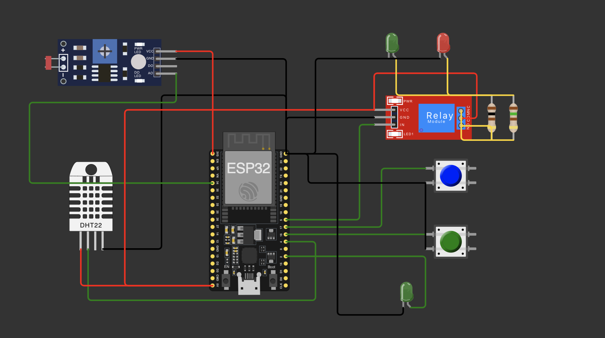

# FarmTechIoT
# FIAP - Faculdade de Informática e Administração Paulista

 

## **Projeto Base: Sistema de Irrigação Inteligente Simulado**

## FarmTech Solutions

## 👨‍🎓 Integrantes: 
- <a href="https://www.linkedin.com/company/inova-fusca">Anna Cecilia Moreira Cabral</a>
- <a href="https://www.linkedin.com/company/inova-fusca">Heitor Exposito de Sousa</a>
- <a href="https://www.linkedin.com/company/inova-fusca">Letícia Gomez Pinheiro</a> 
- <a href="https://www.linkedin.com/company/inova-fusca">Thiago Sabato Romano</a> 
- <a href="https://www.linkedin.com/company/inova-fusca">Vicenzo de Simone Montefusco</a>

## 👩‍🏫 Professores:
### Tutor(a) 
- <a href="https://www.linkedin.com/company/inova-fusca">Leonardo Ruiz Orabona</a>
### Coordenador(a)
- <a href="https://www.linkedin.com/company/inova-fusca">Andre Godoi Chiovato</a>
## **Projeto Base: Sistema de Irrigação Inteligente Simulado**

Fase: 3 \- Proposta de Metodologia e Tecnologias  
Data: 20 de maio de 2025  
O núcleo do projeto consiste em criar um **sistema de irrigação inteligente simulado** na plataforma Wokwi.com, utilizando um **ESP32** como cérebro.

Tecnologias Utilizadas: ESP32, Wokwi.com, Arduino (C++), Python, SQLite.

Componentes Simulados:
 - Sensor de Fósforo (P): Botão (GPIO X)
 - Sensor de Potássio (K): Botão (GPIO Y)
 - Sensor de pH: LDR (GPIO Z, ADC) - valor analógico é interpretado/mapeado para pH.
 - Sensor de Umidade: DHT22 (GPIO W)
 - Bomba de Irrigação: Relé (GPIO R) + LED Indicador (GPIO L)

Lógica de Funcionamento do Sistema:
A bomba é ativada quando a umidade do solo lida pelo DHT22 é inferior a 60% E o valor de pH simulado pelo LDR está entre 6.0 e 7.5. A presença ou ausência de Fósforo e Potássio é registrada mas, nesta versão, não interfere diretamente na ativação da bomba, apenas para fins de monitoramento.

**Desenho**

